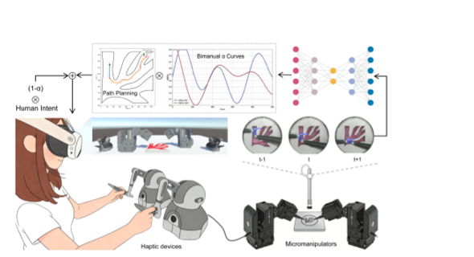

<div align="center">



# Bi-CAST / IROS Research Resources

**Context-Aware Adaptive Shared Control for Magnetically-Driven<br>
Bimanual Dexterous Micromanipulation**

Research code, navigation tools, CAD models, and the project manuscript for
adaptive shared control of magnetically driven microrobots.

[](./IROS2026.pdf)
[](./IROS/pyproject.toml)
[](./IROS/LICENSE)

[Read the paper](./IROS2026.pdf) ·
[Explore the code](./IROS/) ·
[Navigation guide](./IROS/docs/navigation.md) ·
[Training guide](./IROS/training/README.md)

</div>

---

## Overview

This repository accompanies **Bi-CAST**, a context-aware adaptive shared-control
framework for bimanual magnetic micromanipulation. The framework combines
spatio-temporal visual information, spatial risk metrics, and interaction
history to allocate control authority continuously between a human operator and
autonomous assistance.

The repository includes:

- dual-UMP path planning, cost maps, arm switching, and trajectory visualization;
- Bi-CAST model, training, evaluation, and ablation utilities;
- annotation and preprocessing tools for vision, force, and navigation data;
- reproducible navigation configurations and lightweight tests;
- SolidWorks part and assembly files for the robot and maze setup; and
- the eight-page project manuscript as a directly viewable PDF.

## Paper

> **Context-Aware Adaptive Shared Control for Magnetically-Driven Bimanual
> Dexterous Micromanipulation**<br>
> Yongchen Wang\*, Kangyi Lu\*, Lan Wei, and Dandan Zhang<br>
> \*Equal contribution · Imperial College London

Bi-CAST uses a multimodal spatio-temporal network and a bidirectional haptic
interface to support continuous human-machine authority negotiation. In the
reported user study, the framework reduced collisions by up to **76.6%**,
improved trajectory smoothness by **25.9%**, and reduced NASA-TLX workload by
**44.4%** against the evaluated baselines.

### [View or download the manuscript →](./IROS2026.pdf)

GitHub renders the PDF in its document viewer after the link is opened. PDF
files cannot be embedded reliably as interactive documents inside a README, so
the repository provides the linked manuscript and a lightweight preview image
above.

## CAD models

| File | Type | Description |
| --- | --- | --- |
| [`IROS-robot.SLDPRT`](./IROS-robot.SLDPRT) | SolidWorks part | Part-level model of the IROS microrobot geometry, intended for design inspection, dimensional review, and fabrication-oriented modification. |
| [`maze_robot.SLDASM`](./maze_robot.SLDASM) | SolidWorks assembly | Assembly-level model for inspecting the robot together with the maze/test setup. Keep it beside the part file when opening it so linked components can be resolved. |

> [!NOTE]
> GitHub stores SolidWorks files as downloadable binary assets and does not
> preview their native geometry in the browser. Open them with a compatible
> version of SolidWorks for full feature-tree and assembly access.

## Repository layout

```text
.
├── README.md                     # Repository landing page
├── IROS2026.pdf                  # Project manuscript
├── IROS-robot.SLDPRT             # Microrobot part model
├── maze_robot.SLDASM             # Maze–robot assembly
└── IROS/
    ├── src/iros/                 # Installable Python package
    │   ├── navigation/           # Planning and visualization
    │   ├── navigation_experiments/
    │   ├── maze/                 # Maze feature extraction
    │   └── models/               # Bi-CAST network
    ├── configs/navigation/       # Reproducible JSON configurations
    ├── examples/                 # Runnable examples
    ├── tools/                    # Annotation and data utilities
    ├── training/                 # Training and evaluation workflows
    ├── tests/                    # Lightweight validation suite
    └── docs/                     # Focused technical documentation
```

## Installation

Python 3.10 or newer is required.

```bash
git clone https://github.com/Yongchen-Wang/IROS.git
cd IROS/IROS

python3 -m venv .venv
source .venv/bin/activate
python -m pip install --upgrade pip
python -m pip install -e .
```

Install only the optional features you need:

```bash
python -m pip install -e '.[vision]'    # OpenCV and maze analysis
python -m pip install -e '.[training]'  # PyTorch training pipeline
python -m pip install -e '.[ui]'        # Gradio annotation tools
python -m pip install -e '.[dev]'       # Tests and linting
```

## Quick start

```bash
# From the repository's IROS/ package directory

# Export a planned trajectory
iros-export-trajectory \
  --dataset robot_data_20260220_195724 \
  --target A \
  --config configs/navigation/default.json

# Visualize without opening an interactive window
iros-visualize \
  --dataset robot_data_20260220_195724 \
  --target A \
  --config configs/navigation/default.json \
  --no-show

# Run the lightweight test suite
pytest
```

Navigation datasets are read from `IROS/data/navigation/<dataset-name>` by
default. Large datasets and generated outputs can be stored elsewhere:

```bash
export IROS_DATA_ROOT=/path/to/navigation-datasets
export IROS_OUTPUT_ROOT=/path/to/results
```

## Documentation

| Topic | Guide |
| --- | --- |
| Navigation and planning | [`IROS/docs/navigation.md`](./IROS/docs/navigation.md) |
| Trajectory export | [`IROS/docs/trajectory_export.md`](./IROS/docs/trajectory_export.md) |
| Bi-CAST model | [`IROS/docs/bicast_model.md`](./IROS/docs/bicast_model.md) |
| Training parameters | [`IROS/docs/training_parameters.md`](./IROS/docs/training_parameters.md) |
| Training workflow | [`IROS/training/README.md`](./IROS/training/README.md) |

## License

The software under [`IROS/`](./IROS/) is released under the
[Apache License 2.0](./IROS/LICENSE). Please contact the authors regarding reuse
of the manuscript or CAD assets where separate permission may be required.
